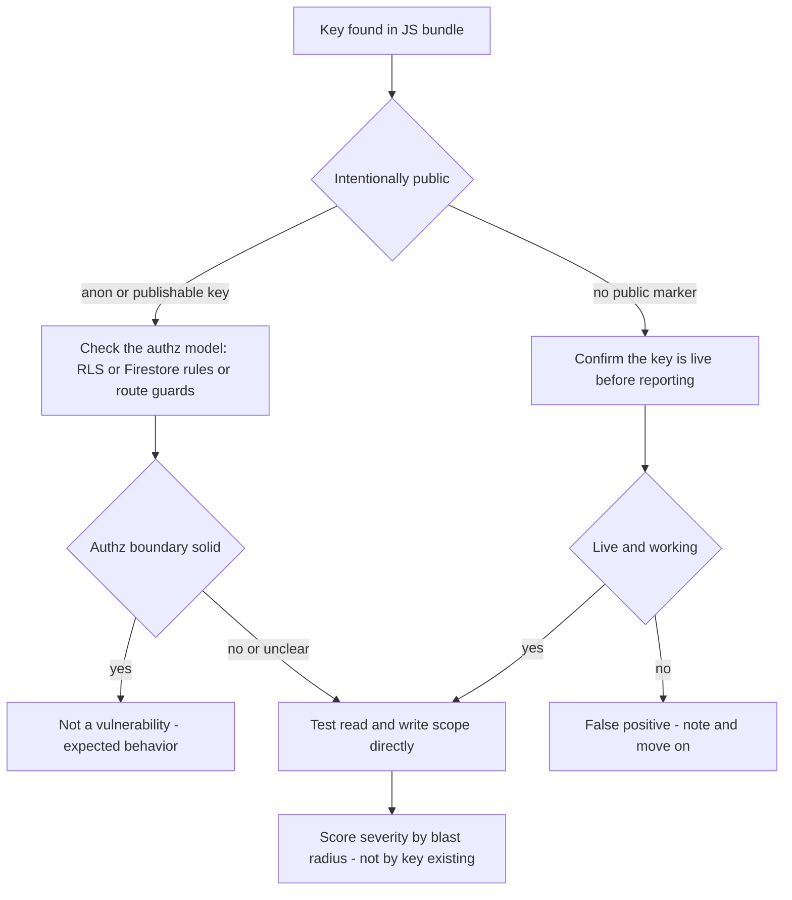

We've hit this exact pattern on more than one engagement now: a modern SPA or JAMstack app, shipping a secret in the client bundle that should never have left the server. Two separate assessments, two different stacks, same root cause. This is the methodology we use to find it and the judgment call that separates a real finding from noise.

## Why this keeps happening

Modern frontend stacks (React SPAs, Supabase or Firebase-backed apps, Vite/CRA builds) push more logic and more configuration into the browser than the server-rendered apps of a decade ago. Developers reach for `.env` variables assuming a build step protects them, without always distinguishing between variables meant for the **server** and variables meant to be **public by design**.

The result, on both engagements where we found this: a credential sitting in plaintext inside a `.js` bundle served to anyone who loads the page. In one case it was a BaaS platform's public anon key, which turned out to be fine on inspection. In the other, it was a private signing key, which was not.

## Where we actually looked

We don't read source code for this, most of the time we don't have it. We read what ships.

```bash
# fetch every JS asset the page actually loads, not just the entrypoint
curl -s https://target.tld/ | grep -oE 'src="[^"]+\.js"'

# pull each one and grep for key-shaped strings
for url in $(cat js_urls.txt); do curl -s "$url" -o "$(basename "$url")"; done
grep -rnE '(apikey|api_key|secret|signature|token)["\x27]?\s*[:=]' *.js
```

On the first engagement, a global `env.js` file was being served unauthenticated from the app's config path, the kind of file automated scanners sometimes wave through as "just frontend config." Manual inspection of it turned up a signing key, a static API signature, and a feature-flag client key, all hardcoded in plaintext. On the second, a Supabase project URL and its `anon` key were sitting in the built JS bundle, which by itself isn't unusual.

## The part that actually requires judgment

Finding a key in a bundle isn't the finding. What that key can *do* is the finding, and that's not always obvious from the key alone.



On the Supabase engagement, we didn't stop at "found the anon key." Supabase anon keys are meant to be public, the actual security boundary is Row Level Security on the tables behind it. We tested table access directly against the API with the extracted key:

```bash
curl -s "https://<project>.supabase.co/rest/v1/profiles" \
  -H "apikey: <ANON_KEY>" -H "Authorization: Bearer <ANON_KEY>"
```

Every table we tried came back empty (`[]`), which told us RLS was actually enforced. That's the correct, boring outcome: a public key sitting in front of a locked door isn't a vulnerability, it's the design working. We still flagged it in the report as informational, since RLS misconfiguration is exactly the kind of thing that regresses silently when someone adds a table later and forgets the policy, but we didn't score it as an exploitable finding because it wasn't one.

The `env.js` signing key was a different category entirely. A key meant to *sign* requests, not just authenticate as a public client, is not something that's supposed to have a public/anon tier at all. There's no RLS-equivalent boundary behind it to check: **possessing the key is the authorization.** We didn't need to prove impact by forging a signed request against production to make that case; the design itself was the finding. We reported it as critical and recommended immediate rotation.

## Fix guidance we gave both times

- Treat any credential not explicitly designed for public exposure as server-only, full stop. If it's not prefixed `NEXT_PUBLIC_` (or your framework's equivalent) and it's still showing up in a browser network tab, that's the bug, regardless of what the key is *for*.
- For BaaS platforms, the anon key being public is fine. What needs auditing is the authorization policy behind it (Row Level Security, Firestore rules, whatever your platform calls it). We test that boundary directly rather than assuming it from the key's existence.
- Signing keys, HMAC secrets, and anything used to *produce* a valid credential rather than just present one, never belong in a client bundle. There's no client-side equivalent that's safe here.
- Rotate on discovery regardless of which category it falls into, and check access logs for the exposure window. Client-side secrets sit exposed far longer than server-side ones on average, because nothing alerts on their presence in a public bundle the way it would on a leaked server `.env` file.
