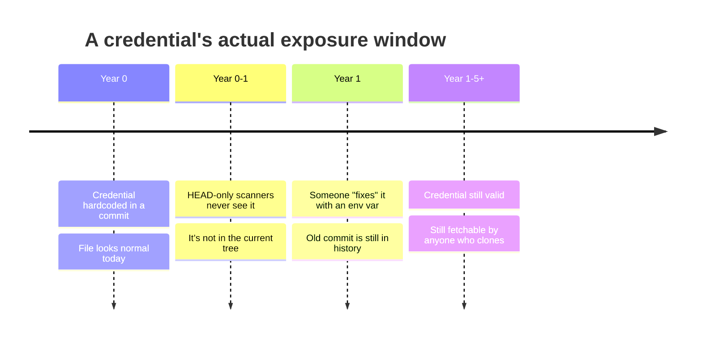

This started as a habit we picked up after finding the same class of issue on enough engagements, and enough open-source codebases we've poked at for our own research, that we now run it by default instead of as an afterthought: sweep the full git history, not just the current branch.

## The blind spot

Most teams run secret scanning against their current branch state: a pre-commit hook, a CI step on `HEAD`. That catches new leaks going forward. It does nothing for credentials committed years ago, removed from the current tree, but still sitting readable in git history, which is exactly as fetchable as the current tree for anyone who clones the repo.



The pattern repeats across unrelated codebases we've reviewed, both client engagements and open-source projects: a config file gets committed early in a project's life, often a template or scaffold file nobody revisited, with real credentials hardcoded "temporarily." Someone later replaces it with environment-variable references in a subsequent commit, and nobody gives a second thought to the fact that the old commit is still there. Git doesn't forget unless someone makes it forget, and almost nobody does.

## Why these stay live longer than fresh leaks

A credential leaked in today's commit gets caught by GitHub's push-protection or a scanning bot within minutes on most platforms now. A credential sitting in a commit from years ago has none of that. It was committed before those protections existed, or before the repo had any scanning at all, and nothing re-scans history retroactively unless someone runs the tool by hand.

The result: these credentials can validate as live for years after exposure, because nobody's monitoring for them and nobody thinks to check history once the current file looks clean. We've confirmed live credentials this way that had been sitting in public history for the better part of a decade.

## The sweep, in practice

```bash
# quick manual pass: full history text search for common credential shapes
git log -p --all | grep -E "(AKIA[0-9A-Z]{16}|xox[baprs]-[0-9A-Za-z-]+|-----BEGIN.*PRIVATE KEY-----)"

# more reliable: run a dedicated scanner against the full history, not just HEAD
trufflehog git file://. --only-verified
```

The `--only-verified` flag is the part that actually matters. A full-history sweep produces a large volume of pattern matches, most of which are rotated, expired, or placeholder values that happen to look key-shaped. Live-validation, actually attempting auth against the relevant API with the extracted credential, without performing any state-changing action, is what separates a real finding from noise. It's also the difference between a report someone acts on immediately and one that gets deprioritized as "probably already dead," which is the fastest way for a real finding to sit unfixed.

We treat any live hit this way as sensitive by default until it's been reported and rotated: we don't publish specifics of an unresolved live credential, ours or anyone else's, because doing so before the owner has fixed it just hands the exposure to more people. This applies whether we found it on a client engagement or while poking at an open-source project's history for our own research.

## What good hygiene looks like

- Scan full git history at repo onboarding, not just going forward. Run `trufflehog git file://. --only-verified` against `--all` branches once, when adopting scanning for an existing repo, not just on new commits from that point on.
- Treat "removed from current tree" as a no-op for credential validity. Rotation is the only real fix; deleting it from the current file does nothing for history.
- If a credential is confirmed live in old history, purging history (`git filter-repo` or BFG) only protects *future* clones. Anyone who already cloned before the purge keeps the exposed value indefinitely. Rotation is mandatory regardless of whether history gets rewritten.
- For third-party or vendor credentials found embedded from an old template or scaffold, verify who actually owns the account before assuming it belongs to the current maintainers. We've seen this misattribution slow response more than once, chasing the wrong team costs the exposure window more time it didn't need to lose.
