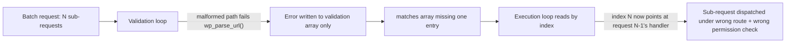
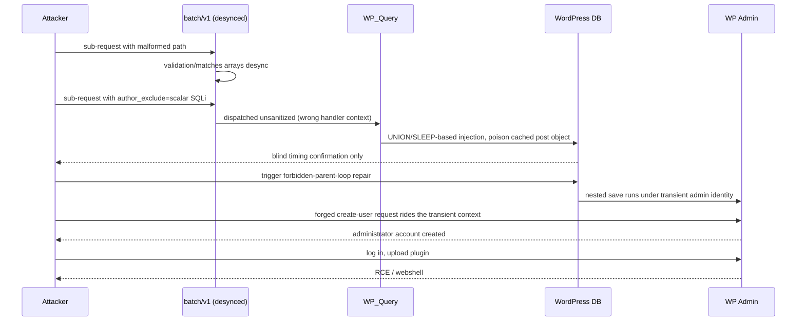

An unauthenticated attacker with nothing but network access to a default WordPress install could walk out with a webshell. No plugins, no misconfiguration, no login. wp2shell (CVE-2026-63030 chained with CVE-2026-60137) is one of those bugs where every individual step looks small on its own, and the chain is the whole story. Disclosed by Searchlight Cyber on July 17, 2026, KEV-listed four days later once exploitation in the wild was confirmed. This is a breakdown of how it actually works, plus a local lab to see the first link in the chain for yourself.

## The setup: two loops that stop agreeing with each other

The entry point is `/wp-json/batch/v1`, WordPress core's REST batch endpoint. It exists so a client can bundle several REST sub-requests into one HTTP call instead of round-tripping the network for each one. To do that safely, the batch controller has to validate every sub-request before executing any of them, so one bad request in the batch doesn't leave the site in a half-applied state.

That validation and that execution happen in two separate loops over what's supposed to be the same list of sub-requests.

The bug: when `wp_parse_url()` fails to parse a sub-request's path, the resulting error gets pushed into the validation array, but the corresponding entry in the matches array is never written. One loop is now one item short relative to the other. Every sub-request after the bad one is off by one position, and gets evaluated against the wrong handler and the wrong permission check.



That's CVE-2026-63030 on its own: a route-confusion bug, CWE-436, that lets attacker-controlled input dispatch under a handler it was never validated against. It's not RCE by itself. It's a way to make a request arrive somewhere it shouldn't, having skipped the checks that request type normally gets. It needs something waiting on the other side worth reaching, and WordPress core had one.

## The payload the desync unlocks: SQLi in `author__not_in`

`WP_Query` accepts an `author__not_in` parameter, exposed over the REST API as `author_exclude`. The sanitization for it does the right thing when the value arrives as an array: it runs `absint()` on every element, so `[1, 2, "'; DROP TABLE"]` gets coerced down to safe integers.

The check is `is_array($value)`. If the value arrives as a scalar string instead of an array, that whole sanitization branch is skipped, and the raw string goes straight into the `NOT IN (...)` clause.

```
post_author NOT IN ( <value> )
```

A normal request through the standard REST route gets its parameters coerced before they reach that point. The batch desync above is what lets a sub-request skip that coercion, arrive at the query builder as a bare scalar, and turn:

```
post_author NOT IN (1)
```

into

```
post_author NOT IN (1) OR SLEEP(6)#
```

The trailing `#` comments out the rest of the original clause, including the closing parenthesis WordPress was expecting to write itself. Confirming this without touching data is a straightforward timing oracle: send a baseline request, send a `SLEEP(0)` control to prove the query path executes at all, then send an increasing `SLEEP(n)` and watch the response time move with it. No error message, no visible output, just a delay that tracks the number you asked for. That's the whole footprint of a blind SQLi confirmation, and it's also as far as this post's own lab goes.

## From blind SQLi to an admin account, without ever logging in

This is the part of the chain that's genuinely clever rather than just careless. The injection is blind. It doesn't return password hashes or session tokens in a response body. What multiple write-ups converged on describing is that attackers use it to poison cached `WP_Post` objects, specifically their `post_status`, `post_type`, and `post_parent` fields, rather than to read data out directly.

WordPress has a repair routine that runs when it detects a post with a broken or circular parent chain (a "forbidden parent loop"). Triggering that repair from a poisoned object causes WordPress to perform a nested save while a specific administrator identity is transiently treated as the acting user, mid-repair. A forged Customizer changeset publish, timed inside that window, gets evaluated as if that administrator had triggered it.

The practical effect: a REST sub-request that would normally 401 immediately (create a new user) gets re-evaluated inside that transient admin context and succeeds. An administrator account now exists on the site, and at no point did the attacker present a password, a session cookie, or an auth header. It was manufactured entirely out of a database write that was never supposed to be attacker-reachable.

From there the rest is the boring, well-worn part: log in as the new admin, `plugin-install.php` a plugin containing a PHP webshell, and you have code execution on the host.



## Who's affected, and who patched what

| Branch | Vulnerable | Patched |
|---|---|---|
| 6.8.x | 6.8.0–6.8.5 | 6.8.6 |
| 6.9.x | 6.9.0–6.9.4 | 6.9.5 |
| 7.0.x | 7.0.0–7.0.1 | 7.0.2 |

No plugin required, no non-default config required. It's core, and it's reachable by an anonymous user with nothing but a network path to `/wp-json/`.

## Reproducing the first link, safely

We built a local, non-destructive lab for this rather than running any public PoC against a target we don't control: a docker-compose stack running vulnerable WordPress 6.9.4, brought up and installed via `wp-cli`, `127.0.0.1` only.

```bash
cd lab
./setup.sh
# site: http://127.0.0.1:8080   wp-admin: admin/adminpass
```

Against that lab, a detection probe fingerprints the core version and sends one side-effect-free batch request designed to surface the desync signature, an inconsistent per-item response count, without ever touching `author__not_in` or attempting the SQLi:

```bash
cd poc
python3 -m venv .venv && . .venv/bin/activate && pip install requests
python3 probe.py http://127.0.0.1:8080
```

That's intentionally where our reproduction stops. The full weaponized chain, the exact SQLi payload construction, the forbidden-parent-loop repair trigger, and the admin forgery, is Searchlight Cyber's disclosure to own the canonical writeup on, and multiple public PoCs already exist for anyone testing their own infrastructure. Rebuilding and publishing a copy of someone else's full exploit isn't the useful part of this post; understanding why a validation loop and an execution loop drifting out of sync is enough to end in RCE, is.

## The actual lesson

Neither bug here is exotic. An off-by-one between two loops that are supposed to describe the same list, and a sanitization check that assumes its input's type instead of asserting it. Individually, a code reviewer might not even flag either one as security-relevant. Chained, they're a full pre-auth RCE against the most widely deployed CMS on the internet.

If you run WordPress and haven't confirmed your version is 6.8.6, 6.9.5, or 7.0.2 or later, that's the whole fix. If you can't patch immediately, block `/wp-json/batch/v1` (and the `?rest_route=/batch/v1` query-string equivalent) at your WAF or reverse proxy as a stopgap, that's the choke point every step after it depends on.
