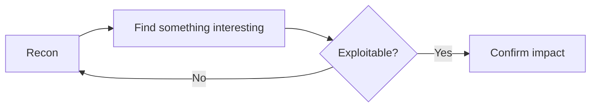

Open with the finding or the point, not a warm-up paragraph. Readers decide in the
first two lines whether to keep going.

## Use H2 for major sections

Body text goes here. Write in plain sentences, active voice, no filler. One idea
per paragraph.

Do not use em dashes anywhere in post content. Use a period, comma, colon, or
parentheses instead. Write "the key is public by design, so that alone is not a
bug," not a version stitched together with a long dash.

### Use H3 for a subsection inside an H2

Only go to H3 when a section genuinely has sub-parts. Do not skip straight to H3
without an H2 above it, and do not go past H3, the table of contents only tracks
H2 and H3.

## Code blocks

Always tag the language for syntax highlighting. Use `bash` for shell commands,
`text` if there is no real language (e.g. raw output).

```bash
# comments in code blocks are fine and get highlighted correctly
curl -s https://example.tld/api | jq '.data[]'
```

## Diagrams

Use a ` ```mermaid ` code block for flowcharts, sequence diagrams, or timelines.
It renders as a live diagram, not a code block, no image to export or upload.



## Inline code and emphasis

Use single backticks for `file names`, `commands`, `variable_names`, and
`api_endpoints`. Use **bold** (renders in the brand accent color) for the one or
two things per section you actually want the reader's eye to catch, not for every
important-sounding phrase.

## Lists

- Keep list items short. If an item needs more than two sentences, it is probably
  a paragraph, not a bullet.
- Use a numbered list only when order or sequence actually matters (steps to
  reproduce, ranked findings).

## Images

Put image files in `public/images/posts/<your-slug>/`, then reference them with a
normal Markdown image tag:

```

```

Alt text is not optional, it is read aloud by screen readers and used by search
engines. Describe what is in the image, not "screenshot" or "image 1."

## Closing

End on the takeaway or the fix, not a summary that just repeats the introduction.
